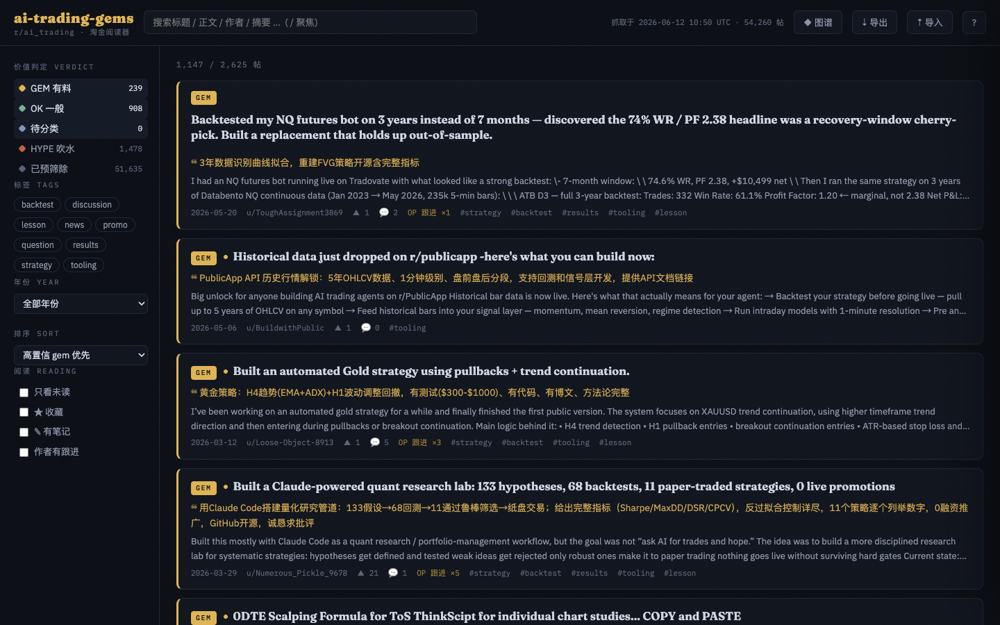

# ai-trading-gems — r/ai_trading 淘金阅读器

Find the signal in [r/ai_trading](https://www.reddit.com/r/ai_trading/): a full archive
of the subreddit, LLM-classified to separate substantive ideas & practices (**gem**)
from empty hype (**hype**), with full comment threads wherever the author follows up,
a reading-focused browser on GitHub Pages, and a local research pipeline for deep
analysis with `claude -p`.

**Live site**: https://hoveychen.github.io/ai-trading-gems/



**54,260** posts archived (2020-09 → today) · **2,625** prefilter candidates ·
LLM-classified: **239 gem** / 908 ok / 1,478 hype

## How it works

```
Arctic Shift API ──► scrape.py ──► posts.jsonl + comments.jsonl
                                        │
                              prefilter.py (heuristics: body length,
                              author follow-up in comments, score)
                                        │
                              classify.py  ← LOCAL ONLY, claude -p
                              (gem / ok / hype + tags + 中文摘要)
                                        │
                              build_data.py ──► data.json + threads/*.json
                                        │
                 ┌──────────────────────┴──────────────────┐
            index.html (GitHub Pages)               dump.py (LOCAL)
            阅读器 + 笔记 + 知识图谱                 research/*.md → claude -p
```

- **GitHub Actions** (`update.yml`) re-scrapes daily and refreshes `data.json` +
  `threads/`. New posts appear as `pending` until the next local classify run.
- **Classification runs locally** (uses your Claude subscription, no API key in CI):

  ```bash
  python3 scrape.py && python3 prefilter.py     # refresh raw data
  python3 classify.py                            # claude -p, resumable
  git add classifications.jsonl && git commit -m "classify batch" && git push
  ```

- **Notes live in your browser** (localStorage): reading states, stars, per-post
  notes with `[[wiki-links]]`, concept notes. The knowledge-graph view grows from
  the `[[links]]` you write. Use ⇣ 导出 / ⇡ 导入 to back up or move devices.

- **Local deep research**:

  ```bash
  python3 dump.py --status gem --tags strategy backtest
  claude -p "Read research/*.md and synthesize the recurring strategies, \
  what actually worked, and common failure modes." --add-dir research
  ```

## Files

| File | Purpose |
|---|---|
| `index.html` | Single-file reader (no build step) — filters, full threads, notes, graph |
| `data.json` | Post index: status, tags, 中文摘要, signals |
| `threads/<id>.json` | Full nested comment tree per prefilter-passed post |
| `scrape.py` | Posts + comments full-history scrape (resumable cursors) |
| `prefilter.py` | Heuristic candidate filter → `candidates.jsonl` |
| `classify.py` | Local `claude -p` batch classification → `classifications.jsonl` |
| `build_data.py` | Builds `data.json` + `threads/` |
| `dump.py` | Markdown research bundles → `research/` (gitignored) |
| `serve.sh` | Local launch (`./serve.sh`, needs HTTP for `fetch`) |

## Run locally

```bash
./serve.sh        # http://localhost:8000
```

## Verdict guide

| Status | Meaning |
|---|---|
| `gem` | Concrete reusable substance: strategy details, backtests with numbers, tooling write-ups, honest post-mortems |
| `ok` | Some content but thin or unverifiable |
| `hype` | Promotion, vague bragging, engagement bait |
| `pending` | Passed prefilter, awaiting next local classify run |
| `filtered` | Failed prefilter (no body, no author follow-up, no discussion) |
